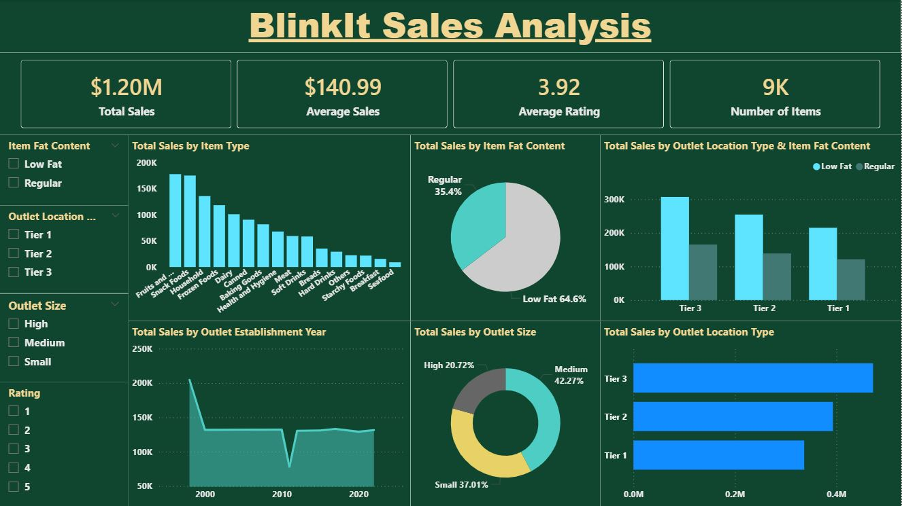

# 🛒 BlinkIt Sales Analysis

## 📌 Project Summary
This project analyzes **$1.2M in sales data** from over 8,500 transactions to identify revenue drivers and outlet efficiency. Using **Python (Pandas)**, I cleaned raw transactional data and performed Exploratory Data Analysis (EDA) to uncover geographic and category-level trends.

## 🚀 Key Insights & Results
* **Top Revenue Drivers:** Identified **Fruits & Vegetables** and **Snack Foods** as the leading categories, contributing ~30% of total revenue.
* **Geographic Performance:** Found that **Tier 3 cities** are the strongest market, generating **$472K (39%)** of total sales.
* **Efficiency Metric:** Determined that **Medium-sized outlets** outperform High-capacity stores in sales-to-space efficiency, generating **$444K** in revenue.
* **Consumer Behavior:** Validated that **Low Fat items** maintain consistent demand across all outlet sizes, totaling **$748K** in sales.
  
  

## 🛠 Technical Workflow
* **Data Cleaning:** Handled missing values and standardized categorical attributes (Item Fat Content, Outlet Size).
* **EDA:** Utilized groupby and multi-index aggregation to segment performance by outlet tier and product type.
* **Visualization:** Created trend charts and distribution plots using **Matplotlib** to communicate findings clearly.

## 🧰 Tech Stack
* **Language:** Python
* **Visualization:** Matplotlib
* **Tools:** Jupyter Notebook, Power BI
